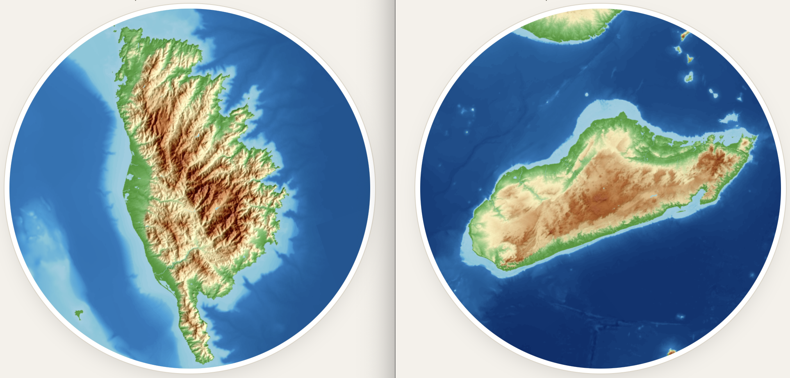
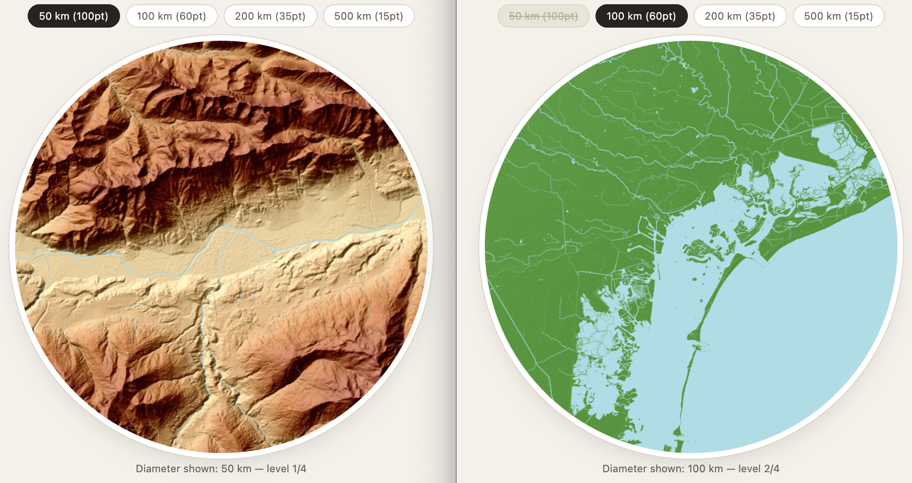
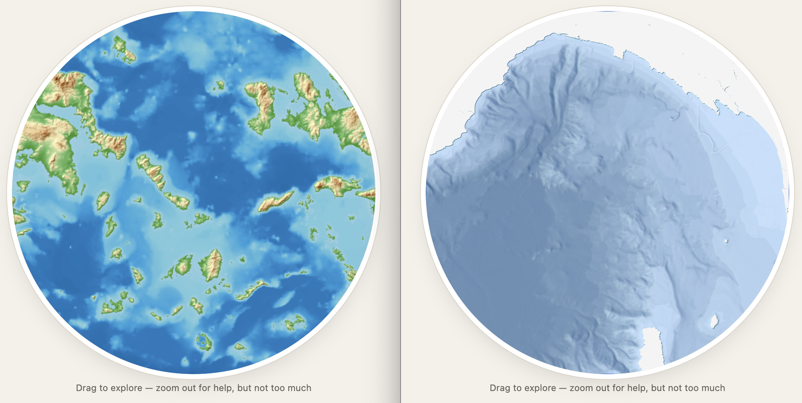
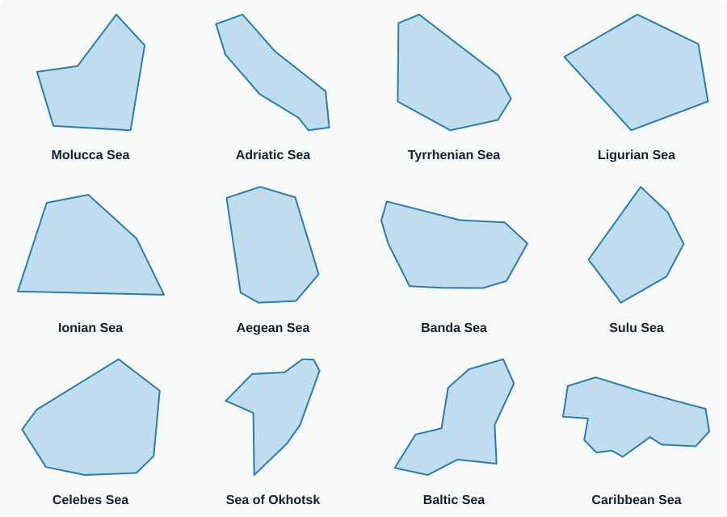
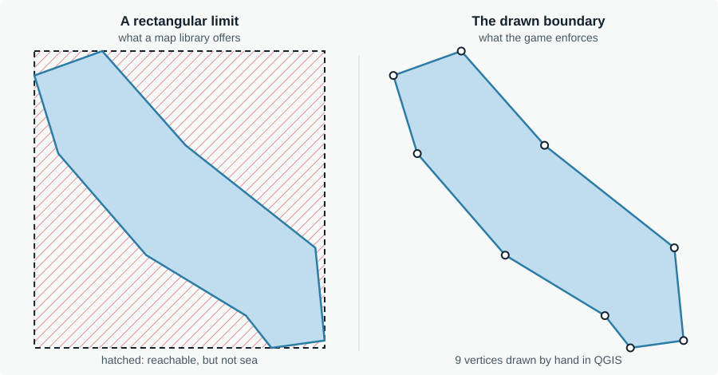

## Why I built it

Plenty of geography games exist online: recognise a flag, a country outlines, or guess where
a photo was taken. I wanted to design one myself, starting from what I already knew and
exploring technologies that were new to me but fit what the game needed. The aim was something
new and hard enough for geography nerds.

## From one idea to three games

### Turn the map around

In 2025, Brazil's statistics institute, IBGE, published an [inverted world map](https://en.mercopress.com/2025/05/08/brazil-s-new-world-map-sparks-debate-a-southern-perspective-on-global-geography):
south at the top, Brazil at the centre. Every map is a choice of what goes on top, and this one
makes that choice openly. It also unsettled me. My brain links a shape or a flag to a country so
comfortably that, with the map turned around, the same task suddenly became much harder. That
gave me the first game: a well-known island (I had Corsica's iconic shape in mind) shown in the
usual Mercator projection, but at a random angle. The tests were real brain gymnastics, which is
exactly what I wanted.

<figure>
  
  <figcaption>

How long did it take you to recognise these 2 islands?
Yes! It's Corsica and Madagascar!
</figcaption>
</figure>

### Read the land, not the outline

I cycle, and I love long or steep climbs. Year after year I got to know the Alps better. Could
I recognise a city from its valley and the ranges around it? The second game shows only the
relief of a place and asks for the city; each wrong guess zooms out a little. Mountain cities
and coastal cities turned out to be two different puzzles.

<figure>
  
  <figcaption>

Innsbruck and Venice, two cities with opposite topography
Using the same OpenTopoMap basemap, both screenshots come from the Mountain cities and Coastal cities mini-games, respectively.
</figcaption>
</figure>

### Lose yourself at sea

Seas can be huge and, apart from the famous ones, little known. Given only a small patch of one, whether through the relief of its coasts and islands or through bathymetry alone, and free to drag the map around, how long does it take to name it? I drew each sea's boundary by hand in QGIS, and the hard variant uses bathymetric tiles.

<figure>
  
  <figcaption>

When not given enough land to recognise, familiar seas become harder to identify
Yes, you're looking at the Greek islands (left) and the Ligurian Golf (right)
</figcaption>
</figure>

## How a round works

A session is eight rounds. Before it starts, you choose whether to answer by multiple choice or by
typing the name. In the city and island-relief series, a round is worth 100 base points, reduced if
you have to zoom out, plus 25 for answering within the time window: five seconds, or three in hard-timer
mode. A perfect session is 1,000 points. A wrong guess does not end the round: the circle zooms out one
level and the base score drops. The other series play differently, as the table shows.

When you type your answer, you can ask for a hint: the flag of the country (for half the points) in the
city and whole-island series, or an extra zoom-out for 10 points in the island-relief series. For islands
shared by several countries, the flag is one of them.

| Series | Places | What you see |
|---|---|---|
| Mountain cities | 13 | Real relief in a circle, with no coastline to lean on |
| Coastal cities | 14 | Relief with shoreline, bays and deltas |
| Islands, whole view | 27 | The island fitted to its outline and rotated at a random angle; one guess, no timer |
| Islands, relief | 27 | The zoomed circle applied to islands |
| Seas | 12 | A pannable patch of land relief around the sea; unlimited guesses, no timer, each wrong guess costs 20 points |
| Seas, hard | 12 | Underwater topography only; land is left blank, so only the bare outline of the coast shows |

Places are chosen for how well their terrain reads, from well-known cases like Hong Kong and Cuba to more distinctive ones like Sarajevo, Bogotá or Sulawesi. Islands whose shape gives the answer away too easily, such as Australia or Greenland, are left out on purpose.

## How it is built

The whole game is a single HTML file: no build step, no backend, no framework. It is hosted on GitHub Pages.

- **MapLibre GL JS** draws the map. It switches between two styles depending on the mode: an OpenTopoMap relief raster,
  which is genuinely free of place names, and a custom MapTiler bathymetric style for the hard sea mode.
- **Island outlines** come from Natural Earth (50 m) through `world-atlas` and `topojson-client`. Borneo and New Guinea
  are cut from the physical landmass rather than from a single country's polygon, so the shape is not truncated at a border.
- **Sea boundaries** are polygons I drew by hand in QGIS, five to sixteen vertices each, to keep the player from drifting too far away.

<figure>
  
  <figcaption>The twelve sea boundaries as drawn in QGIS, each scaled to its own cell.</figcaption>
</figure>

## Decisions worth explaining

### Sharper tiles by rendering twice as large

The map is drawn at twice its visible size and scaled back down with CSS. MapLibre therefore requests tiles one zoom
level finer, and a clean downsample looks sharp where an upscaled tile looks blurry. The extra level is capped at each
source's real maximum so the game never asks for tiles that do not exist. Padding values in the code have to be doubled
as well, because they are measured in that larger pixel space.

### No waiting between rounds

Waiting for tiles would eat into a fast player's speed bonus. While a round is played, the game drives a second,
invisible map to the next location, so the browser cache is already warm when the next round starts.

### A boundary that matches the sea

A map library limits panning to a rectangle, and a sea is not a rectangle. The bounding box of the Adriatic is mostly Italy
and the Balkans. The game therefore checks the player's view against the hand-drawn polygon in real time, and a red
vignette warns for as long as the view sits at or past the edge.

<figure>
  
  <figcaption>The Adriatic Sea: what a rectangular limit allows, and the polygon the game enforces instead.</figcaption>
</figure>

### One projection per kind of round

Terrain rounds use MapLibre's globe projection, which avoids Mercator's distortion near the poles and matters for Antarctica.
Seas and whole-island rounds use plain Mercator, because the globe's pan-boundary and rotated-fit maths were unreliable.
The code tracks the active projection and only switches when it really changes: switching in the middle of a camera move
produced a broken frame.

### A debug mode for the content

Adding `?debug` to the address steps through every place in every series, with direct access to each zoom level and each
viewpoint. It exists to catch bad viewpoints and badly drawn sea limits without playing full sessions.

## What I learned

**A place has to earn its spot.** Flat, dry cities such as Phoenix show almost nothing on a relief map at the scale of other cities. They are nearly impossible to identify, not because they are obscure but because there is little to read, so I replaced Phoenix with Athens and its famous hills.

**The data source decides the game.** My first version used a custom MapTiler style, and the look was rather dry and uninspiring.
While testing sources in QGIS I found a relief-only [OpenTopoMap](https://opentopomap.org/about) tile endpoint with no place names, which was exactly the look I had imagined, and visually pleasing too.

**Know where your data stops.** SRTM, the elevation model behind most relief tiles, does not cover polar latitudes, so
Antarctica mostly shows ice. The game therefore uses a few hand-picked coastal viewpoints there and never shows the whole continent.

**Playtesting drives the engineering.** The prefetching and the continuous warning at a sea's edge both exist because
playing the game showed what was wrong.

**New tools, learned by building.** MapLibre GL JS and MapTiler were both new to me. I chose them for what the game needed: a map whose style and projection can change from one round to the next, and a bathymetric basemap for the hard sea mode. Learning how tiles, zoom levels and camera moves interact is where most of the decisions above came from.

**How I worked.** I built this with an AI coding assistant. I wrote the brief for each iteration, chose the concept, the places
and the data, drew the sea boundaries, tested every build on real maps and decided what stayed. The assistant did most of the typing.

## What comes next

- Load the place data from GeoJSON files instead of keeping it in the HTML, so the list can grow.
- More series, rivers or borders among them.
- Address the known limits: a simplified flag hint for multi-country islands, and no polar relief data for Antarctica.

## Data and credits

Relief tiles by [OpenTopoMap](https://opentopomap.org/) (CC-BY-SA), built on OpenStreetMap and SRTM data. Bathymetric style by
[MapTiler](https://www.maptiler.com/), built on OpenStreetMap data. Island geometry from
[Natural Earth](https://www.naturalearthdata.com/). Mapping library: [MapLibre GL JS](https://maplibre.org/).
