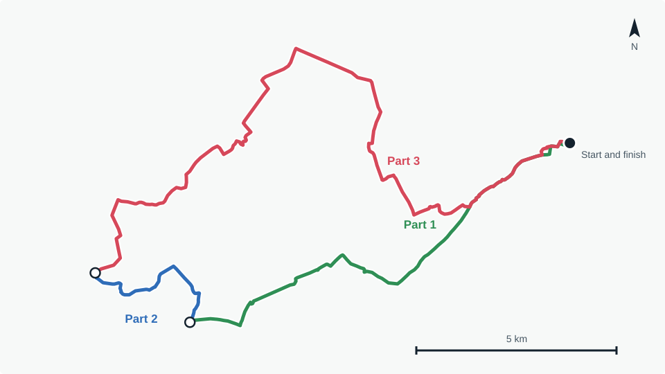
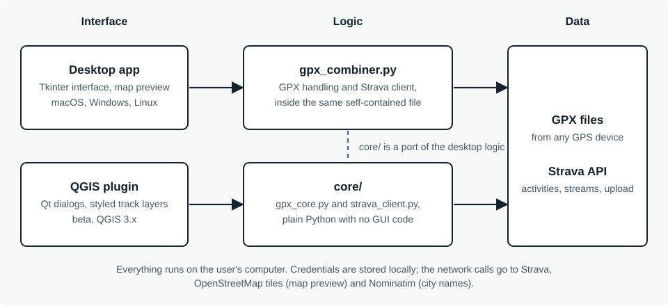

## The problem

A long ride is often recorded as several GPX files. Putting them back together by hand is fiddly, and Strava's API
does not offer a GPX export, so getting activities out of Strava for the same job is awkward too. I wanted one small tool
that does both, runs locally and needs no account beyond Strava's own.

<figure>
  
  <figcaption>Three consecutive recordings of one 39 km ride, taken from the repository's test files. The app's map preview also gives each file its own colour; this figure is rendered for this page, not captured from the app.</figcaption>
</figure>

## What it does

- Combines several GPX files into one, in chronological order.
- Imports activities from Strava, with paging, date filtering and each activity's gear, and downloads them as GPX.
- Uploads the combined file back to Strava and helps avoid duplicates.
- Previews all loaded tracks on an OpenStreetMap map, each in its own colour, with start and finish markers.
- Lets you keep or drop heart rate, cadence, power and temperature.
- Speaks French, English, Spanish and German.

## How it is built

The desktop app is a single self-contained Python file of about 2,500 lines. It uses only the standard library, with
Tkinter for the interface; `tkinterdnd2` (drag and drop) and `certifi` (certificates in packaged builds) are optional.

The QGIS plugin reuses the same logic through `core/`, a host-agnostic port with no GUI code. `core/` deliberately does not
save credentials itself: the host does, in a JSON file for the desktop app and in QGIS settings for the plugin. The
trade-off is two copies of the same logic that have to be kept in step.

<figure>
  
  <figcaption>Two products, one behaviour, and where the shared logic lives.</figcaption>
</figure>

## Decisions worth explaining

### Rebuilding GPX from Strava's data streams

Strava's API returns activities as streams (time, position, altitude and, when recorded, heart rate, cadence, power
and temperature), not as files. The app requests these streams and writes a GPX from them. The extension tags follow
the format of Strava's own exports, so a combined file can be uploaded back and read as if it had been recorded natively.

### OAuth without a server of my own

Strava requires every app to be registered. Instead of shipping a shared secret, each user registers their own Strava
application and pastes its ID and secret into the app once. The authorisation response is caught by a tiny web server that
runs on `localhost` for the length of the login. Credentials stay on the user's computer and can be erased from the settings window.

### Splicing recordings without misleading data

Files are sorted by their first timestamp before they are merged. Some devices, COROS for example, write a cumulative distance for
each recording; once two recordings are spliced it becomes wrong, so the app always strips it, while speed and heart rate,
which stay valid point by point, are kept.

### Not creating duplicates on Strava

When a combined file goes back to Strava, the app checks whether any source file came from an existing Strava activity and
offers to open those activities so they can be deleted first. Strava keeps deleted activities recoverable for 30 days.

### Shipping it: macOS and Windows builds

The app is packaged with py2app for macOS and PyInstaller for Windows, and published as GitHub releases. Packaging is where
hidden assumptions surfaced. A packaged app cannot reach the system certificate store, so Strava calls failed with SSL errors
until I bundled `certifi`. The builds are unsigned, which is why the README walks through the Gatekeeper and SmartScreen prompts.

### A responsive interface

The activity list shows the city each ride started near. That needs reverse geocoding with OpenStreetMap's Nominatim service,
limited to one request per second by its usage policy. It runs in the background and results are cached, so the table never
freezes while it waits.

### A plugin that declines to install where it is untested

The plugin's metadata caps the supported QGIS version at 3.99. QGIS 4 will not offer it until I have tested it there.

## What I learned

**Packaging is its own problem.** Certificates in a bundled app, Tk on a Homebrew Python, an icon that only appeared on the
Windows executable: none of it shows up when you run the script from a terminal.

**Constraints shape the design.** No GPX export meant rebuilding files from streams. Strava's registration rule meant a local
callback server and per-user credentials. Working around what an API does not do took more thought than calling what it does.

**Sharing logic between two hosts forces clear boundaries.** Deciding that `core/` never touches the disk or the interface,
and that each host owns its own persistence, is what made the plugin possible.

**Version numbers and changelogs pay off.** The version is in the window title, and the plugin shows its own version, so I can
tell at a glance which install I am looking at.

**How I worked.** I built this with an AI coding assistant. I defined the behaviour, tested every build against real
files and real Strava data, chose the packaging and the architecture, and decided what shipped. The assistant did most of the typing.

## What comes next

- QGIS 4 support, once the plugin is out of beta and better tested on QGIS 3.
- Full paging and date filtering in the plugin's Strava import, matching the desktop app.
- Publication in the official QGIS Plugin Repository.
- Checking the plugin on Windows and Linux.
