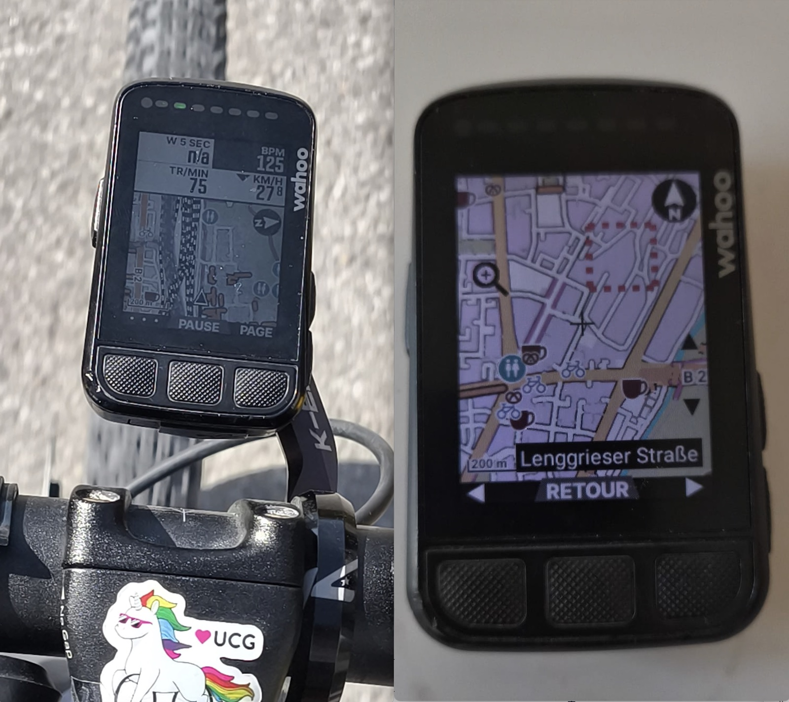
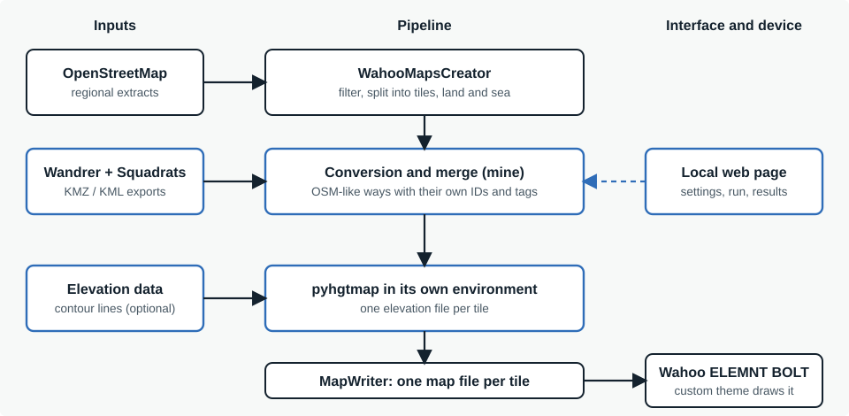
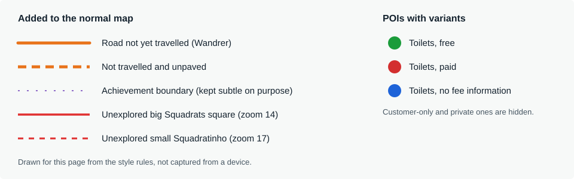
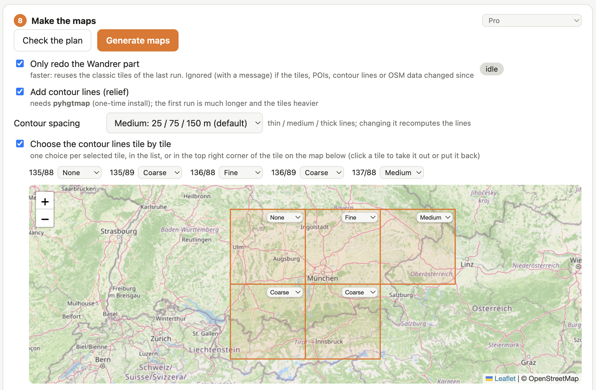
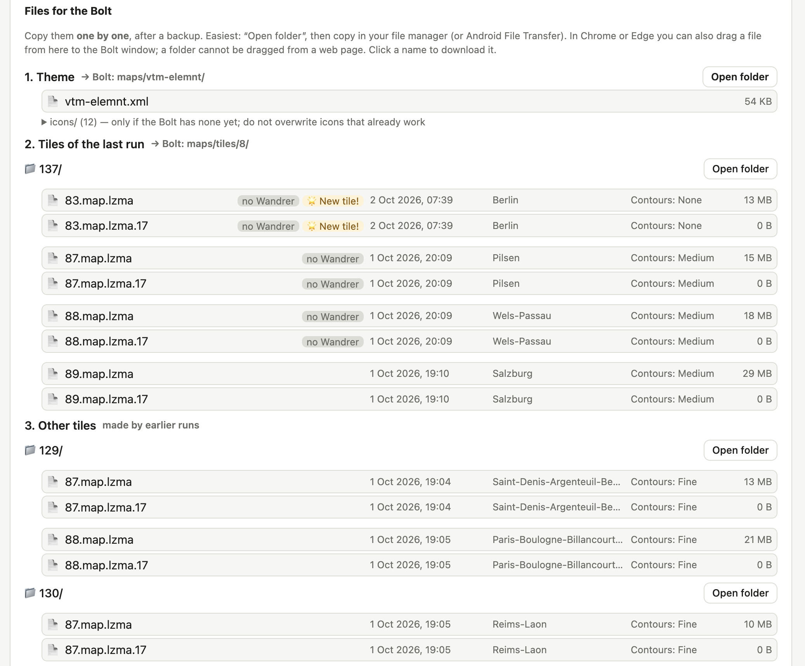
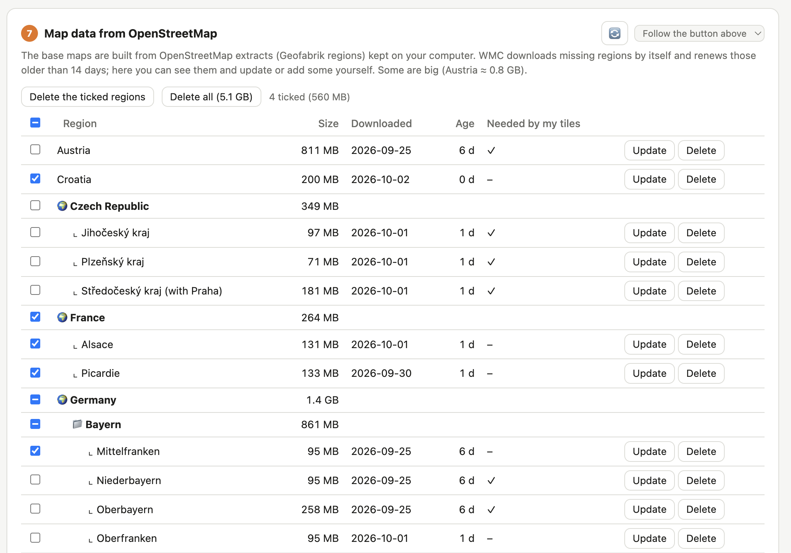

## The problem

[Wandrer.earth](https://wandrer.earth) tracks which roads you have cycled and gives you Wahoo-ready maps with the roads you have not yet ridden highlighted. I have used those maps for years, and they come with a trade-off: either the very plain Wandrer map style, or the colours and detail of Wahoo's own maps. A third option, [WahooMapsCreator](https://github.com/treee111/wahooMapsCreator) (WMC), builds far prettier and more detailed maps, with points of interest, but it knows nothing about my Wandrer history.

What I wanted was both at once: a detailed map where, at a glance, I can see which roads are still unexplored, and where the squares of the Squadrats game I have not yet visited are outlined too. A bike computer like Wahoo's Bolt v2 shows one map, so this cannot be a second layer on top of it: the extra information has to be inside the map file. Those maps come as one file per zoom-8 tile, roughly 100 km wide in central Europe, so each tile is built separately.

<figure>
  
  <figcaption>The Bolt v2 screen showing orange unvisited roads mid-ride and the Squadrats dashed outlines.</figcaption>
</figure>

## Why a merge and not an overlay

My first idea was to use Wandrer's data instead of a normal map; I dropped it for an overlay inside a detailed map. I also looked at Wandrer's own vector tiles, the ones its browser extension displays, and dropped that too: the endpoints are internal and authenticated, and the extension's code is proprietary. My own KMZ export is a simpler and explicit source, so the pipeline starts from that.

The second decision shaped everything after it: Wandrer data stays an independent geometry. It is never matched with OpenStreetMap roads. Wandrer and WMC may use different OpenStreetMap snapshots, with roads split, merged or re-tagged between them, and matching would bring many problems and no benefit. Wandrer lines are simply extra ways in the map, with their own IDs and tags, drawn on top of the OpenStreetMap roads.

<figure>
  
  <figcaption>The pipeline. The blue boxes are the layers I intertwined; the rest is WahooMapsCreator and the standard tools it calls.</figcaption>
</figure>

## What it does

- Reads several Wandrer exports and merges them: where two exports overlap, the newest wins.
- Keeps only the unvisited roads that matter: those within 250 m of roads I have ridden, simplified and chained, so tiles stay light. Everything is a setting, because my preferences are not everybody's.
- Outlines the Squadrats squares I have not explored, in two sizes, around the ones I have.
- Adds the points of interest I use on the road, with icons that change with the data (free or paid toilets, for example).
- Optionally adds contour lines, with a level of detail chosen for each tile.
- Treats Wandrer and Squadrats as independent layers: Squadrats alone need no Wandrer export, and exports that do not touch the chosen tiles are never even unzipped.
- Reads each export's metadata (date, activity type, main town, tiles) so that I choose what to merge.
- Manages the OpenStreetMap regions it downloads: date, size, age, update or delete.
- Does all of it from a local web page, with a Simple and a Pro mode.

<figure>
  
  <figcaption>What the extra layers look like on the BOLT.</figcaption>
</figure>

## Decisions worth explaining

### Three places for every tag, or it silently disappears

A custom tag has to be declared in three places: the tag mapping that tells the map writer what to encode, the list of tags the Osmium filter keeps, and the theme that draws it. Miss one and nothing fails: the data simply never reaches the map. The first time I added the Squadrats layer, one list was missing and the layer vanished without a single error. The only symptom was tile files whose size did not change. The repository's rule since: check the data before the style. If a tag is not in the file sent to the map writer, editing the theme does nothing.

### Squadrats as integer arithmetic

A [Squadrats](https://squadrats.com) square matches the boundaries of an ordinary OpenStreetMap web tile, so everything is computed with integer tile indices, with no geometric error. The export holds the explored squares, dissolved into polygons with holes; the tool rebuilds them exactly (the counts match) and outlines the unexplored ones around them, each edge drawn once.

### Designing for a screen where line width does not scale

On the BOLT, line widths do not follow the zoom level. A thick line that reads well at the 200 m scale I use most becomes a wall of colour when zoomed out. So the styles are a compromise tested on the device: small Squadrats squares are dashed and only a little thinner than the big ones, so they stay distinguishable; they are visible at the 500 m scale, and the big ones at 5 km. Wandrer boundaries are deliberately faint and easy to switch off. Roads not yet ridden at the 500 m scale are essential for me; at 1 km they are only useful.

### Points of interest that depend on a second tag

A toilet icon can be green (free), red (paid) or blue (no information), and customer-only or private ones are hidden. The trick is a rule in the theme where `-|a|b` means "neither a nor b", which also includes the case where the tag is absent. Today the POI catalogue is a table (tag, condition, icon, zoom) from which the tag mappings, the filter list and the theme rules are generated, so adding a place type no longer means editing three files by hand. The default style is never modified: my own choices are stored separately and one button restores the defaults. I deliberately kept the list short: a bike repair station and a camp site were worth adding, restaurants and pharmacies were not, because a phone search makes more sense for them.

### Contour lines, and the cost of detail

Contour lines come from free elevation data and a tool called pyhgtmap, installed in its own small environment so it cannot disturb the main one. They turned out to be the heaviest feature: a tile with 10 m contour lines was 25 to 34 MB on the two tiles I tested, against 16 to 19 MB for a tile from Wahoo and 25 to 30 MB for a plain WMC tile. On the device I judged 25 m spacing readable enough, since relief is not my priority and the elevation profile on the unit helps too.

So the spacing became a choice: three presets (10 / 50 / 100 m, 25 / 75 / 150 m, 30 / 90 / 180 m), in which the medium and thick lines are always multiples of the thin ones so they fall on an existing line. And because a flat tile around Munich and an Alpine tile do not need the same detail, the choice can be made tile by tile, from a dropdown placed in the corner of each tile on a map.

<figure>
  
  <figcaption>Test build with synthetic tiles: the contour level chosen tile by tile.</figcaption>
</figure>

### A web page instead of a desktop window

I considered a desktop window, as in my previous Python project. I chose a small local web page (a Python server and a Leaflet map) for two reasons: a map you can click to choose tiles is much simpler in a browser, and the same page can later be wrapped in a standalone app. The page only listens on my own computer.

Simple mode hides what most people do not need; Pro mode shows what is inside each export and unlocks the radius, the contour spacing or the point-of-interest editor. Each section can have its own mode too. The rule behind it: the page only builds command lines for the scripts, so every option exists in the command line first, with a default.

### Making a long build safe

A full build takes a long time, so the tool is built around not wasting it or losing work. A run replaces only the tiles it rebuilds and keeps the others, one tile per coordinates. If I want several versions of a tile, I keep them myself. An option to redo only the Wandrer part checks first that the tiles, contour lines, points of interest and map data are unchanged since the last full build, and rebuilds everything, with a clear message, otherwise. A red STOP button cancels a run, the log ends with the total time, and the build can go on if the browser is closed, because it belongs to the terminal that started it. Tiles with no Wandrer data are copied from the classic build and marked as plain tiles, so the output folder is always the complete set for the device.

<figure>
  
  <figcaption>Test data: the files to copy to the Bolt, newest run first, with date, town, contour level and size.</figcaption>
</figure>

### Respecting the data and the licences

Wandrer exports are personal, so the repository never contains them: no KMZ, no map files, no generated tiles, and exports live outside the project. WMC is used as a pinned dependency, not copied or modified. OpenStreetMap data is under the ODbL, and WMC is GPL-3, which is why the licence will probably be GPL-3 as well. I have not added a licence file yet; reading what each licence requires comes first.

<figure>
  
  <figcaption>The downloaded OpenStreetMap regions, grouped by country.</figcaption>
</figure>

## How I tested it

Most of the testing happens on the device itself: copy a tile to the BOLT, look at it on the road, at the scale I really use. The code has 92 automated tests, on synthetic data only. The bike computer keeps its own few generated tiles around my position, which can overwrite a test file, so I learned to work with the production tiles and to copy file by file, never replacing a folder, after a backup of the maps folder.

<!-- TODO photos: the BOLT at 200 m, 100 m and 50 m scales (contour lines), and 500 m (Squadrats) -->

## What I learned

**Silent failures are the worst kind.** A layer that disappears without an error cost me more time than any crash. Since then I check the data before touching the style, and I make scripts say out loud what they skipped.

**A device is part of the design.** Line widths that do not scale, a theme engine my desktop preview does not have, tiles that get regenerated by the device itself: none of it appears on a screen at my desk. The only real test is the BOLT in my hand.

**Make the choices visible.** Every setting that came from my own habits (250 m, three squares of band, 25 m contours) is a parameter with a default, because the next person will want something else.

**A tool for other people needs less installation than I thought it would.** The environment problems that kept me from using WMC for years are exactly what a standalone app should hide.

**How I worked.** I built this with an AI assistant. I set the goals, made the data and design decisions, tested each result on the device, and decided what stayed. The assistant did most of the typing, and explained things to me along the way, which is how I learned the map-building tools.

## What comes next

- Test the contour lines on the road: file size, start-up time and battery over a full ride.
- Give the bike repair stations a proper icon and show them by default, and check the shelters on the ground.
- Warn when a freshly built tile is suspiciously small, and list the date of each source region next to the files, so I never leave for a ride with an empty or outdated map.
- Package everything as an installer, so nobody has to install Python, Java, GDAL and Osmium by hand: macOS first, then Windows, which matters for most people, and Linux as a bonus.
- Decide on the licence and publish the repository.
- Finish the rename: the texts now say maprBoy, but the Wahoo-specific code and folders still use the internal name Wahoondrer. Other bike computers (Garmin, Karoo) would get parts of their own.
